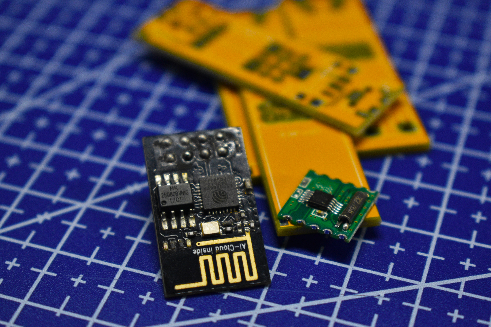
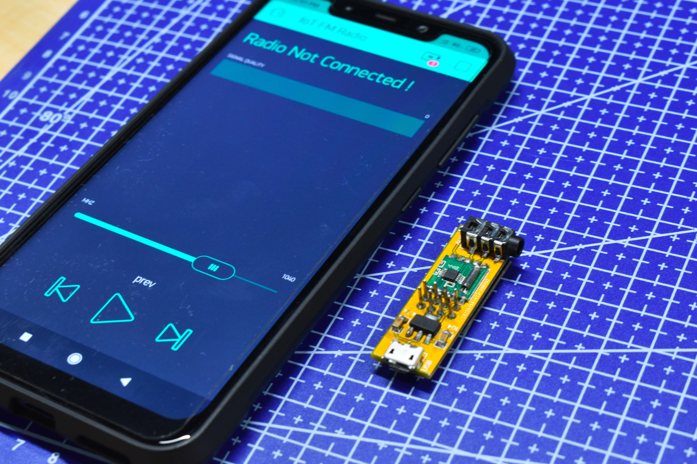
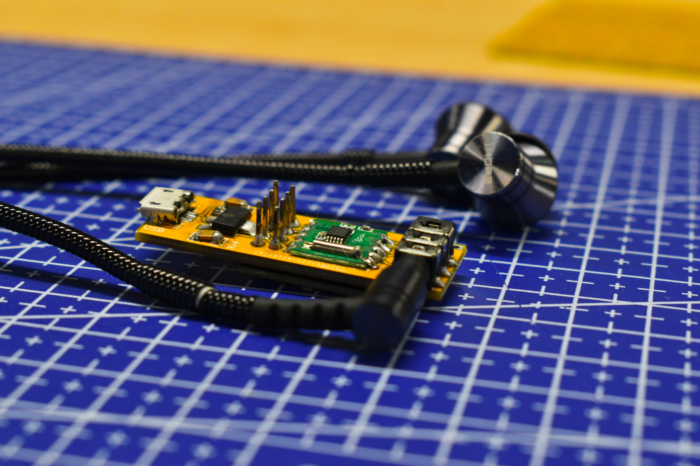

# Dhwani - IoT FM Radio

A WiFi connected FM radio might sound like an over engineered solution for a problem that didn't exist. 

While browsing through the AliExpress, I found these very inexpensive FM radio chips called `TEA5767`.
To try how well they perform, i bought couple of them.
 Let's get into the steps one by one shall we?

## Step 1: Choosing the Micro controller

The `TEA5767` is not a stand alone chip. It communicates with a micro controller via I2C protocol to change channel, play/pause etc.

You can use any micro controller that supports I2C with `TEA5767`, but I wanted to keep the design as simple and economic as possible. and I also wanted to have something interesting in the radio.

So I decided to use an `ESP-01`, for those who don't know, a really cheap development board based on ESP8266 micro controller with WiFi capabilities.

The `ESP-01` has only two GPIO available to use, which is more than enough for our use case as the controls for our device will be through a mobile application.

## Step 2: Designing the PCB

The `TEA5767` breakout comes in a very strange sized PCB. you can't put them to a bread board or solder it to a perfboard, so I decided to design a custom PCB for it.

I used easyEDA to do all my circuit board design.

EasyEDA is a cloud based platform for PCB designing.

You can design it from any computer which has internet access without having to download or install anything; Everything happens in the browser!

The PCB was designed with a 3.5mm audio jack to which you connect your audio device like a speaker or headphone.

The Power to the board is provided through the easily available micro USB cable (which is only for power, you cant program the radio using the USB.)

All the passive components in an SMD to to reduce space on the board.

The idea was to make the device as compact as possible while keeping a lookout for the budget.

## Step 3: Ordering the PCB

Now its time to order the PCBs (P.S.: Probably my favorite part in the whole project).

For this I choose JLCPCB just as I have done for quite some time now. They make very high quality PCBs for around $2.

I uploaded their gerber files to easyEDA and placed the order; within few days of puchase, I got my shiny new PCBs.

The Quality of the PCBs made by JLC is very very high. The silk screen is very bright and readable as well. I strongly recommend JLCPCB for pcb manufacturing.

## Step 4: Soldering the components

A hot air station is perfect for this project as the components are SMD, I didn't have one, so hand soldered it. I started with Micro USB port as it is the hardest part.
Then I soldered other components like resistor and `TEA5767` chip.

I removed the black plastic covering on the header of the `ESP-01` so that it sits flushed to the PCB.

## Step 5: Programming the radio

Time to program the radio. The ESP8266 can be programmed using many programming languages such as python, JavaScript , lua etc. For this project however, I will be using arduino.

The radio will be controlled using Blynk, an app that you can use to build IoT devices. Blynk has over 400 hardware models that work out-of-the-box with fast and open-source Blynk Cloud. They can easily connect over WiFi, LTE, 2G-4G, or Ethernet.

Install Blynk from play/app store and create an account.
Blynk will email you an API key. You need to paste this to code.

Click the link to copy my Blynk UI to your app : link
You can download the code from here
You have to also also add your WiFi credentials in the code .

You can now upload the code to ESP. 
There are many solutions available to  upload code to the esp. Here I'm using a modified `ESP-01` USB to serial converter.

You can use an arduino or USB serial converters like `cp2102` or `ch340g`.

If everything went okay, You can see that the 'Device connected' label on the Blynk app.
Once you're done, try Connecting an audio device like a speaker or an earphone to the audio jack on the device. You can set the channels manually using the scroll bar or use the search functionality to tune to radio stations from the app.

